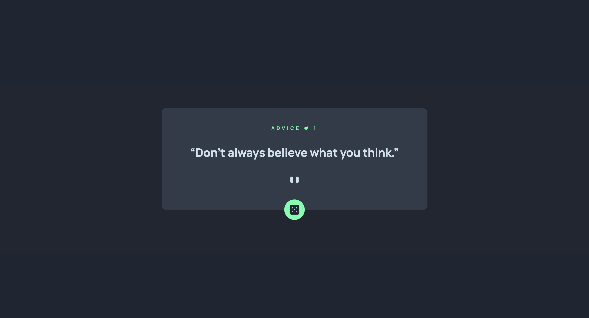

# Frontend Mentor - Advice generator aap solution

This is a solution to the [Advice generator app challenge on Frontend Mentor](https://www.frontendmentor.io/challenges/advice-generator-app-QdUG-13db). Frontend Mentor challenges help you improve your coding skills by building realistic projects.

## Table of contents

- [Overview](#overview)
  - [The challenge](#the-challenge)
  - [Screenshot](#screenshot)
  - [Links](#links)
- [My process](#my-process)
  - [Built with](#built-with)
  - [What I learned](#what-i-learned)
- [Author](#author)

## Overview

### The challenge

Users should be able to:

- View the optimal layout for the app depending on their device's screen size
- See hover states for all interactive elements on the page
- Generate a new piece of advice by clicking the dice icon

### Screenshot



### Links

- Challenge URL: [Challenge URL here](https://www.frontendmentor.io/challenges/advice-generator-app-QdUG-13db)
- Live Site URL: [live site URL here](https://abuobayeh04.github.io/advice-generator-app-main/)

## My process

### Built with

- Semantic HTML5 markup
- CSS custom properties
- CSS Grid
- Janilla JavaScipt

### What I learned

In this challenge i practice on fetching API and recive data and display it in my website :D

This is the code of fetchin and display data:

```js
fetch("https://api.adviceslip.com/advice")
  .then((res) => {
    if (!res.ok) {
      throw new Error(`HTTP error! status: ${res.status}`);
    }
    return res.json();
  })
  .then((data) => {
    adviceId.innerText = data.slip["id"];
    adviceP.innerText = data.slip["advice"];
  })
  .catch((err) => {
    console.error(err);
  });
```

## Author

- linkedIn - [Muhammad Abu Obayeh](https://www.linkedin.com/in/muhammadabuobaya/)
- Frontend Mentor - [@AbuObayeh04](https://www.frontendmentor.io/profile/AbuObayeh04)
- Twitter - [@AbuObayeh04](https://www.twitter.com/AbuObayeh04)
